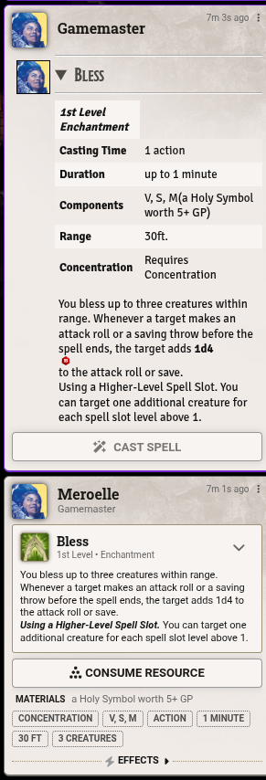

# Combat Spell Timer

Track spell durations and time-limited abilities right in the Foundry VTT combat
tracker. When a spell or ability with a finite duration is used during combat, a
timer entry appears in the tracker showing the spell or ability, who used it, and
how many rounds are left. It counts down on its own and clears itself when the
effect ends.

**System:** D&D 5e (`dnd5e`) 5.0.0+ — the module is inactive on other systems.
**Foundry VTT:** v13 – v14

## What it does

Cast a spell or activate a tracked ability while you're a combatant in an active
encounter, and a timer row is added to the combat tracker. Each timer row shows:

- the spell or ability's icon and name
- the caster's name
- the round it was cast or activated on
- the rounds remaining
- an editable initiative box (just like a real combatant)

Timers count down automatically as the encounter advances and disappear when they
reach zero.

## How timers behave

**Position in the tracker.** Spell timers take their own place in initiative order
and sit *above* any combatants sharing their initiative. How the initiative is
chosen depends on when and how the spell was added:

- **Cast during an active turn** — the timer takes the initiative of the combatant
  whose turn it currently is.
- **Cast before combat starts, caster has already rolled** — the timer takes the
  caster's own initiative immediately.
- **Cast before combat starts, caster hasn't rolled yet** — the timer starts with
  no initiative and sits beneath the caster. Once the caster rolls, the timer
  inherits that value and locks in — it won't move again if the caster's initiative
  later changes.
- **Added via the existing-concentration dialog** — the GM can enter an initiative
  directly. If left blank, the timer behaves as in the pre-combat case above.

Rage timers always sit directly above the owning combatant's row rather than at
a fixed initiative position.

**Countdown.** A timer loses one round each round of combat, the moment the turn
order reaches an initiative equal to or lower than the timer's — i.e. when the
turn marker passes the timer's row.

**Editing the initiative.** Type a new value into a timer's initiative box to move
it in the order. It accepts an absolute number, or a relative change like `+2` /
`-1` (the same syntax the tracker uses for combatants).

**Removing a timer.** Right-click a timer row and choose **Remove Spell Timer**
(or **End Rage** for rage rows). Removing a concentration spell timer also ends
concentration on the caster. (The default combatant menu entries don't apply to
timer rows.)

## Concentration (D&D 5e)

Concentration spells are kept in sync both ways:

- Ending concentration on the caster removes the timer.
- Removing the timer, or letting it expire, ends concentration.

**Joining combat while concentrating.** If an actor that's already concentrating
on a trackable spell is added to an encounter, the GM is asked whether to add a
timer for it (with an editable round count) or to drop concentration. If the
actor has no initiative yet, the timer sits beneath them until they roll, then
takes that initiative once — after which it no longer follows the owner.

**Leaving combat.** If a combatant that owns one or more timers is removed from
the encounter, the GM is prompted to keep or remove those timers:

- **Keep** — the timer rows remain in the tracker exactly as they were.
  Concentration on the caster is *not* ended; the caster simply left this combat.
- **Remove** — the timer records are deleted from this encounter, but again
  concentration is *not* ended. This differs from right-clicking a row and
  choosing **Remove Spell Timer**, which does end concentration.

If the same actor is re-added to the encounter after choosing **Keep**, the
existing-concentration dialog is suppressed — the timer is already present and
its values are left as-is.

## Who can do what

- **Players** can edit and remove timers for spells their own character cast.
- **The GM** can edit and remove any timer, and is the only one shown the
  join/leave-combat prompts.

## Supported Non-Spell Abilities

### Barbarian Rage (D&D 5e)

When a Barbarian activates Rage, a timer row is added to the tracker above their
combatant row. At the end of each of their turns, the actor's owner is prompted
to extend the rage or let it end. The Rage token icon is applied automatically
and cleared when rage ends.

Both the 2014 and 2024 rules editions are supported, including Persistent Rage
(level 15+, 2024 rules) and the correct early-end conditions for each edition.

## Integrations

### Beyond20

Works with the Beyond20 extension. Cast a spell or activate Rage from D&D Beyond
while using the Beyond20 extension, and the chat card that appears in Foundry
gains an action button wired to Combat Spell Timer.

- **Spells** — a **Cast Spell** button consumes the appropriate slot and applies
  concentration if required.
- **Barbarian Rage** — a **Start Rage** button applies the Rage effect and begins
  tracking the timer.

_Compatibility — Tested with version 2.20.0 of the browser extension._



### Beyond20 settings in Combat Spell Timer

- **Enable/Disable** — Show or hide the action buttons on Beyond20 chat cards.
- **Auto-cast spells** — Per-player setting that automatically casts the spell
  without pressing the button.
- **Auto-start rage** — Per-player setting that automatically starts Rage without
  pressing the button.
- **Spell Mappings** — Map D&D Beyond spell names to their Foundry equivalents,
  for spells whose names differ between the two.

## Installation

Install from the Foundry module browser, or paste this manifest URL into
**Install Module → Manifest URL**:

```
https://raw.githubusercontent.com/kamcknig/combat-spell-timer/refs/heads/master/module.json
```

## Tutorials

You can find a playlist of videos quickly explaining some of the functionality on the [Combat Spell Timer](https://www.youtube.com/playlist?list=PLNzm8yjPdznaB7YWOwuL0fFM60-okUAbq) YouTube playlist.

## Support

Found a bug or have a request? Please open an issue:
<https://github.com/kamcknig/combat-spell-timer/issues>

Foundry VTT Discord username - kamcknig
